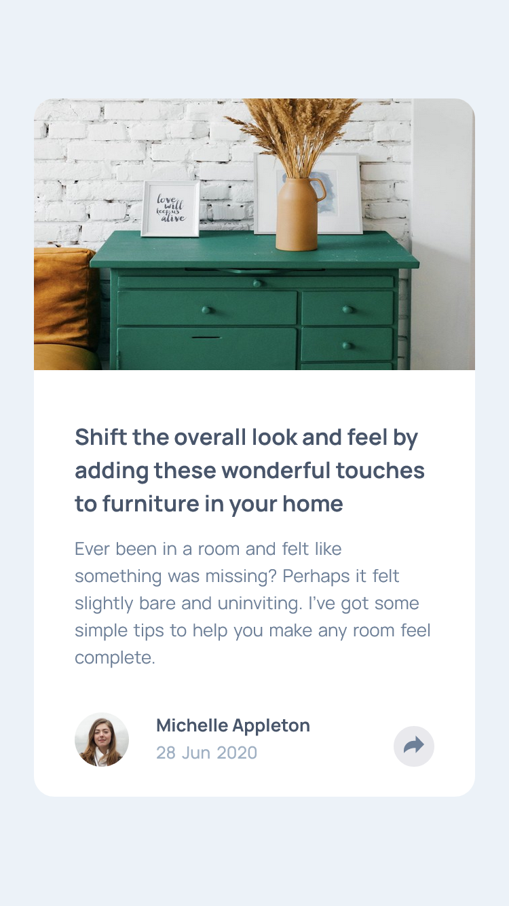
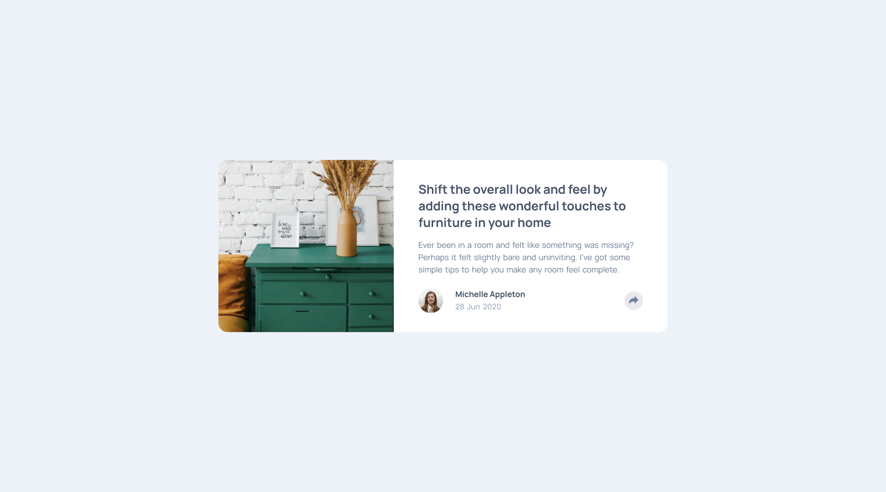

## Welcome! 👋🏼

# Frontend Mentor - Article Preview Component

[Frontend Mentor](https://www.frontendmentor.io) challenges help you improve your coding skills by building realistic projects

## Table of contents    

- [Overview](#overview)
  - [The challenge](#the-challenge)
  - [My Achievements](#my-achievements)
  - [Screenshot](#screenshot)
  - [Links](#links)
- [My process](#my-process)
  - [Built with](#built-with)
- [Author](#author)

## Overview

[This is an entry-level NEWBIE(Free) challenge that uses HTML, CSS & JS](https://www.frontendmentor.io/challenges/article-preview-component-dYBN_pYFT)

## The challenge

- build out this article preview component and get it looking as close to the design as possible.
- set hover states for interactive elements using Javascript

## My Achievements

- built the component almost close to the design provided.
- set hover states for interactive elements using Javascript
- used some additional interactive states for interactive elements using Javascript
    - customized clicked-view state for the article share button
    - zoomed hover state for article presenter

### Screenshot

- mobile-version 

 
- desktop-version  

### Links

- Solution URL: [Frontend-Mentor Solution Page](https://www.frontendmentor.io/solutions/responsive-article-preview-component-using-html-css-and-js-F5nVdm99ma)
- Live Site URL: [GitHub Pages](https://m-lakshan.github.io/FM_Challenge-Article-Preview-Component/)

## My process

### Built with

- Semantic HTML5 markup
- CSS custom properties
- CSS Flexbox
- Mobile-first workflow
- custom interactions using JS
- with Visual Studio Code Editor

## Author

- Frontend Mentor - [@M-lakshan](https://www.frontendmentor.io/profile/M-lakshan)
- Dev.to - [@mlakshan](https://dev.to/mlakshan)
